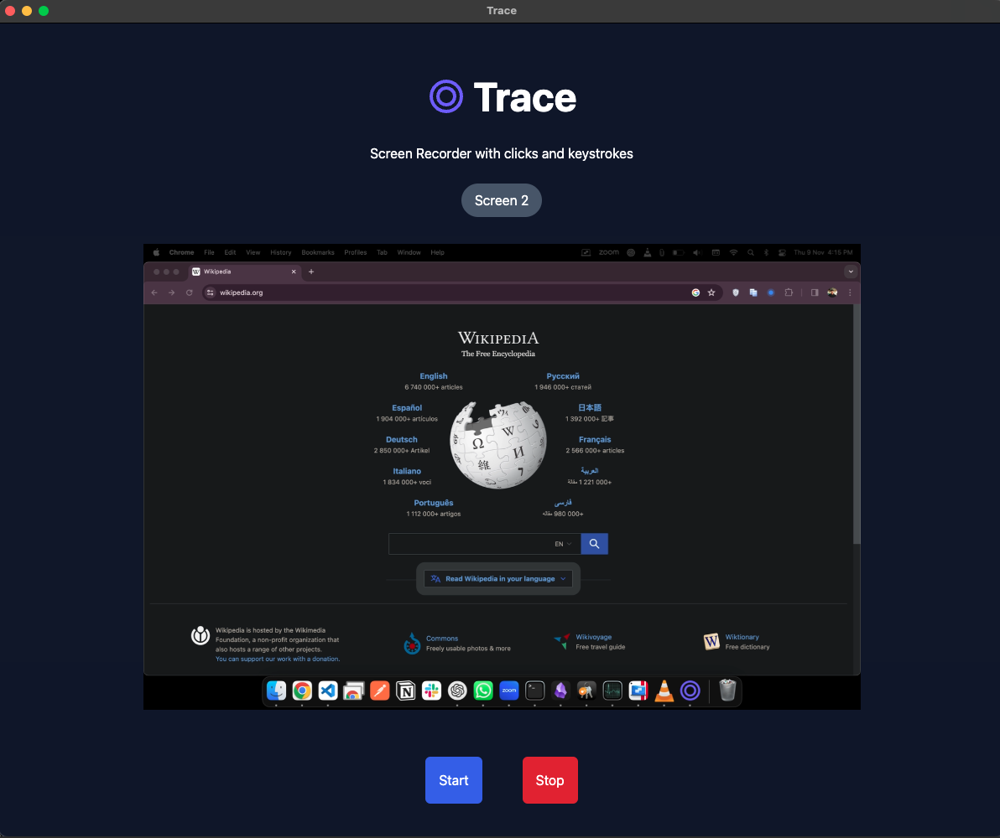

# Trace - Screen Recorder

Welcome to Trace, the intuitive, cross-platform screen recording application that not only captures your screen but also records your clicks and keystrokes to provide a comprehensive viewing experience.



## Features

- Cross-Platform: Runs on Windows, macOS, and Linux.
- Screen Recording: Capture your entire screen.
- Clicks and Keystrokes: Records all mouse clicks and keystrokes alongside the video.
- Simple Interface: Start and stop recording with just a click of a button.

## Download and Installation

To get started with Trace, please visit the [Releases page](https://github.com/suraj-turing/trace/releases) on our GitHub repository.

Depending on your operating system, download the respective executable:

- **Windows**: Download `Trace-Setup-x.x.x.exe`.
- **macOS**:
  - For Intel processors, download `Trace-x.x.x.dmg`.
  - For M1/M2 (ARM) processors, download `Trace-x.x.x-arm64.dmg`.
- **Linux**:
  - Debian-based distributions: Download `Trace_x.x.x_amd64.deb`.
  - Red Hat-based distributions: Download `Trace-x.x.x.x86_64.rpm`.

After downloading the correct file for your operating system, run the installer or executable to install Trace on your machine.

## How to Use Trace

1. Open Trace.
2. Click on the "Choose a Video Source" button to select your video source.
3. Once the video source is selected, the "Start" button will be enabled.
4. Click "Start" to begin recording your screen.
5. Click "Stop" to end the recording. You will be prompted to choose a location to save your zip file containing video and keystroke logs file.
6. You can save/discard the recording (zip file).
7. Once saved/discarded, You'll be redirected to home page where upload feature is available in top right corner.
8. Select zip file and start the upload. It'll show finished status when file is uploaded completely.

## Getting Started

Follow these instructions to get the project up and running on your local machine for development and testing.

### Prerequisites

- [Node.js](https://nodejs.org/) (v18.x)
- Python (v3.11 or lower) (required for `node-gyp` to build native modules, python 3.12 is not supported)

## Starting Development

### Environment Setup

Before running the application, set up the necessary environment variables:

1. Clone the repository
   ```
   git clone https://github.com/TuringGpt/trace.git
   cd trace
   ```
2. Create a `.env` file in the root directory of the project.
3. Add the following variables to the `.env` file (modify values as needed):
   ```plaintext
   MODE='development'
   BLOB_STORAGE_URL='DefaultEndpointsProtocol=http;AccountName=devstoreaccount1;AccountKey=Eby8vdM02xNOcqFlqUwJPLlmEtlCDXJ1OUzFT50uSRZ6IFsuFq2UVErCz4I6tq/K1SZFPTOtr/KBHBeksoGMGw==;BlobEndpoint=http://127.0.0.1:10000/devstoreaccount1;'
   ```
   development mode will skip uploading files to cloud storage.
4. Install the application dependencies (use **node version 18**)
   ```
   npm install
   ```
5. Install azure cli. follow [instructions](https://learn.microsoft.com/en-us/cli/azure/install-azure-cli) for your platform.
6. Verify azure cli installation.
   ```
   az version
   ```
7. Install azurite for local development. azurite is used to create local azure blob storage for testing purpose. we're creating `azure-blob-storage` folder in project root which will be used to mimic upload recordings.
   ```
   npm i -g azurite
   azurite-blob -l ./azure-blob-storage
   ```
8. Create Blob storage container using azure cli.
   ```
   az storage container create --name turing-videos --connection-string "DefaultEndpointsProtocol=http;AccountName=devstoreaccount1;AccountKey=Eby8vdM02xNOcqFlqUwJPLlmEtlCDXJ1OUzFT50uSRZ6IFsuFq2UVErCz4I6tq/K1SZFPTOtr/KBHBeksoGMGw==;BlobEndpoint=http://127.0.0.1:10000/devstoreaccount1;"
   ```
9. Start the application in development mode.
   ```
   npm start
   ```

## Packaging for Production

To package apps for the local platform:

```bash
npm run package
```

To debug the packaged app, will add inspect elements and other capabilities to the packaged app. Run the following command to package the app in debug mode:

```bash
DEBUG_PROD= true npm run package
```

The packaged executable will be available in the `release/build` directory.

To run an analysis of the bundle size:

```bash
ANALYZE=true npm run build
```

## Contributing

Contributions to Trace are always welcome! If you would like to contribute, please fork the repository and submit a pull request, or open an issue with your ideas and suggestions.

## Support

If you encounter any issues or have any questions about using Trace, please file an issue on our GitHub repository.

Thank you for using Trace – Happy Recording!
